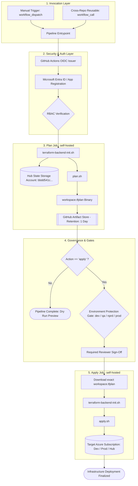

# Enterprise Terraform CI/CD Architecture & Operations Manual

**System Title:** Multi-Environment Terraform Automation via GitHub Actions & Azure OIDC  
**Repository:** `gousebasha/terrafrom`  
**Target Platform:** Microsoft Azure & GitHub Actions  
**Document Version:** 2.0 (Production Release)  

---

## Executive Summary

This document establishes the architecture, security model, component specifications, and operational procedures for the enterprise Terraform continuous integration and delivery (CI/CD) pipeline. 

The pipeline automates infrastructure delivery across multi-tenant, multi-subscription Azure cloud landing zones using a secure, zero-secret (passwordless) authentication framework powered by **GitHub OpenID Connect (OIDC)** and **Microsoft Entra ID Federated Credentials**.

---

## 1. System Architecture & Design Principles



### Core Architecture Pillars

1. **Deterministic Execution:** The `apply` phase never recalculates a plan; it strictly consumes the signed, uploaded `.tfplan` artifact generated during the `plan` phase.
2. **State Isolation via Partial Backend Configuration:** State files are compartmentalized into dedicated Azure Blob Storage containers named after their respective workspace (e.g., container `app-miq-dev` for workspace `app-miq-dev`).
3. **Concurrency Control:** Pipeline concurrency is throttled per workspace (`group: terraform-${{ inputs.workspace }}`) with `cancel-in-progress: false` to eliminate race conditions and backend lease lock contention.
4. **Credential-Free Security (OIDC):** Eliminates static, long-lived client secrets for platform authentication using short-lived (5-minute) JSON Web Tokens (JWT) signed by GitHub.

---

## 2. Directory Layout & Standard Repository Structure

To maintain consistency and allow deterministic path resolution, the repository adheres to the following structural hierarchy:

```text
terraform/
├── .github/
│   └── workflows/
│       ├── terraform.yml               # Central Reusable & Dispatch Pipeline
│       └── test-workflow.yml           # Base Actions Validation Workflow
│
├── environments/                       # Workspace-specific configuration suites
│   ├── app-field-vision-dev/
│   │   └── terraform.tfvars            # Environment-specific variable overrides
│   ├── app-miq-dev/
│   │   └── terraform.tfvars
│   ├── hub-prod/
│   │   └── terraform.tfvars
│   └── ...                             # Additional workspace subdirectories
│
├── scripts/                            # Idempotent shell automation toolset
│   ├── terraform-backend-init.sh       # AzureRM state connection & container init
│   ├── plan.sh                         # Input validation & sealed plan generator
│   └── apply.sh                        # Plan verification & execution engine
│
├── backend.tf                          # Partial backend configuration declaration
├── main.tf                             # Terraform resource definitions
└── variables.tf                        # Schema & variable declarations
```

---

## 3. Subscription & Multi-Account Topology

The pipeline routes infrastructure deployment based on the workspace name pattern:

| Workspace Pattern | Target Environment | Target Azure Subscription ID | Architectural Role |
| :--- | :--- | :--- | :--- |
| `hub-*`<br>`temp-sec-hub-*` | `nprd` / `prod` | `bbdd541c-ac30-44a8-b251-6ceb0006dda0` | Central Connectivity, Hub Firewall, Shared State Storage |
| `*-prod` | `prod` | `d295d8ec-ed35-4e10-b1a1-3341172cd12b` | Mission-Critical Customer Production Workloads |
| `*-dev`<br>`*-qa`<br>`*-nprd` (Default) | `dev` / `qa` / `nprd` | `bf123e28-0e1e-4698-9178-3489e42b1527` | Isolated Non-Production Sandbox & Validation Environments |

---

## 4. Component Technical Specifications

### 4.1. Workflow Orchestrator: `terraform.yml`

- **Dual-Interface Invocation:**
  - `workflow_dispatch`: Provides a self-service interactive GUI with predefined workspace options for team operators.
  - `workflow_call`: Exposes a parameterizable callable module for upstream application repositories to execute infrastructure provisioning within their own release lifecycles.
- **Environment Context Mapping:** Dynamically evaluates workspace naming suffixes to map runs to GitHub Protected Environments (`dev`, `qa`, `nprd`, `prod`), enforcing regulatory approval gates prior to state modification.
- **Runner Allocation:** Defaults to company-managed `self-hosted` runners with fallback parameterization for GitHub-hosted `ubuntu-latest` nodes.

### 4.2. Backend Initializer: `scripts/terraform-backend-init.sh`

- **Operation:** Executes `terraform init` with dynamic runtime overrides:
  ```bash
  terraform init \
    -input=false \
    -reconfigure \
    -backend-config="container_name=${WORKSPACE}" \
    -backend-config="subscription_id=bbdd541c-ac30-44a8-b251-6ceb0006dda0"
  ```
- **Guarantees:**
  - Enforces workspace string validation against regex `^[a-z0-9-]+$`.
  - Verifies existence of the workspace's `terraform.tfvars` file before invoking Terraform.
  - Selects the `default` Terraform workspace to maintain container-isolated state files.

### 4.3. Plan Engine: `scripts/plan.sh`

- **Operation:** Compiles infrastructure declarations and variable files into a compiled binary artifact:
  ```bash
  terraform plan \
    -input=false \
    -var-file="environments/${WORKSPACE}/terraform.tfvars" \
    -out="${WORKSPACE}.tfplan"
  ```
- **Validation:** Enforces pre-flight checks verifying authentication environment variables (`TF_VAR_client_id`, `TF_VAR_tenant_id`, `TF_VAR_subscription_id`).

### 4.4. Apply Engine: `scripts/apply.sh`

- **Operation:** Applies the pre-compiled plan strictly without recalculation:
  ```bash
  terraform apply -input=false "${WORKSPACE}.tfplan"
  ```
- **Security Check:** Halts execution with exit code `1` if `${WORKSPACE}.tfplan` is missing, preventing unintended drift or unauthorized direct deployments.

---

## 5. Security & Authentication Model (Azure OIDC)

### 5.1. Authentication Architecture

Traditional service principal client secrets are susceptible to credential leaks, manual key-rotation overhead, and accidental commit exposures. This pipeline utilizes **OpenID Connect (OIDC)**:

```text
[GitHub Runner Job] 
       │ 1. Requests OIDC JWT (permissions: id-token: write)
       ▼
[GitHub Token Service]
       │ 2. Issues Signed JWT containing claims (iss, sub, aud)
       ▼
[Azure AD / Microsoft Entra ID]
       │ 3. Validates JWT Signature & Issuer
       │ 4. Matches Federated Identity Subject:
       │    repo:gousebash/terrafrom:ref:refs/heads/main
       ▼
[Azure Resource Manager]
       │ 5. Returns Temporary OAuth Access Token (TTL: ~1 hour)
       ▼
[Terraform AzureRM Provider & CLI]
```

### 5.2. Azure RBAC Role Matrix

The unified Application Registration (`AZURE_CLIENT_ID`) requires the following minimum least-privilege role assignments across Azure subscriptions:

| Scope | Resource Target | Required Azure Role | Purpose |
| :--- | :--- | :--- | :--- |
| **Hub Subscription** (`bbdd541c...`) | State Storage Account | **Storage Blob Data Contributor** | Read, write, and acquire leases on `.tfstate` blobs |
| **Hub Subscription** (`bbdd541c...`) | Hub Resource Groups | **Contributor** | Manage central network peering and transit resources |
| **Prod Subscription** (`d295d8ec...`) | Subscription Root / RG | **Contributor** | Provision and manage production infrastructure |
| **Non-Prod Subscription** (`bf123e28...`) | Subscription Root / RG | **Contributor** | Provision and manage Dev, QA, and Non-Prod resources |

---

## 6. Secrets & Environment Configuration Matrix

### 6.1. GitHub UI Configuration Procedure (Where to Add Secrets)

1. Open your target GitHub repository in a browser:
   `https://github.com/gousebasha/terrafrom` (or your repository URL).
2. Click the **Settings** tab (Gear icon ⚙️) in the top repository navigation bar.
3. In the left-hand navigation sidebar:
   - Expand or scroll down to the **Security** category.
   - Click **Secrets and variables** → Select **Actions**.
4. On the Actions secrets page, click the green button: **New repository secret**.
5. Populate the input fields:
   - **Name:** Enter the secret identifier in exact uppercase (e.g., `AZURE_CLIENT_ID`).
   - **Secret:** Paste the corresponding key/value extracted from Azure Portal.
   - Click **Add secret**.
6. Repeat this process for each of the required secrets listed below.

---

### 6.2. Secrets Identification & Azure Extraction Guide

| Secret Identifier | Priority | Azure Sourcing Path & Location | Value Format / Description |
| :--- | :--- | :--- | :--- |
| **`AZURE_CLIENT_ID`** | **Mandatory** | Azure Portal → **Microsoft Entra ID** → **App registrations** → Select App → **Overview** page → Copy **Application (client) ID** | UUID string (e.g., `12345678-abcd-ef01-2345-6789abcdef01`). Acts as the service principal identity. |
| **`AZURE_TENANT_ID`** | **Mandatory** | Azure Portal → **Microsoft Entra ID** → **App registrations** → Select App → **Overview** page → Copy **Directory (tenant) ID** | UUID string (e.g., `87654321-dcba-10fe-5432-10fedcba9876`). Identifies the Azure AD organization. |
| **`AZURE_CLIENT_SECRET`** | **Mandatory** | Azure Portal → **App registrations** → Select App → **Certificates & secrets** → **Client secrets** tab → Click **+ New client secret** → Copy the **Value** column | Secret string (e.g., `~Abc123xyz...`). **Important:** Copy the `Value`, NOT the `Secret ID`. The value is only visible immediately upon creation. |
| **`QG_SHARED_CLIENT_ID`** | **Conditional** | Azure Portal → Shared Services / Auxiliary App Registration → **Overview** → **Application (client) ID** | Only required when executing **`spokes-*`** deployments (`spokes-nprd`, `spokes-prod`). |
| **`QG_SHARED_CLIENT_SECRET`** | **Conditional** | Azure Portal → Shared Services / Auxiliary App Registration → **Certificates & secrets** → Client Secret **Value** | Only required when executing **`spokes-*`** deployments (`spokes-nprd`, `spokes-prod`). |

---

### 6.3. Secret Verification Checklist

Before triggering a pipeline execution, verify the following configuration states:
- [ ] `AZURE_CLIENT_ID` is present under Repository Secrets.
- [ ] `AZURE_TENANT_ID` is present under Repository Secrets.
- [ ] `AZURE_CLIENT_SECRET` contains the valid, unexpired Client Secret Value.
- [ ] `QG_SHARED_CLIENT_ID` & `QG_SHARED_CLIENT_SECRET` are configured if deploying network spokes.


---

## 7. Step-by-Step Testing & Verification Runbook

### Scenario: Validating the `app-miq-dev` Workspace Pipeline

Follow these procedures to conduct an end-to-end verification of the pipeline:

#### Step 1: Environment Workspace Preparation
Ensure the workspace directory and variables file exist locally:
```bash
mkdir -p environments/app-miq-dev
cat << 'EOF' > environments/app-miq-dev/terraform.tfvars
# Test variables for app-miq-dev
environment = "dev"
workspace   = "app-miq-dev"
EOF
```

#### Step 2: Push Configurations to GitHub
```bash
git add .
git commit -m "feat(pipeline): configure app-miq-dev workspace and scripts"
git push origin main
```

#### Step 3: Trigger Dry-Run Plan
1. Open GitHub repository in browser: `https://github.com/gousebasha/terrafrom`.
2. Navigate to the **Actions** tab.
3. Select **Terraform Infrastructure** from the workflow menu on the left.
4. Click **Run workflow**:
   - **Workspace:** `app-miq-dev`
   - **Action:** `plan`
5. Click **Run workflow** (Green button).
6. Verify output logs:
   - Check `Configure Workspace` resolves `ENVIRONMENT=dev` and `SUBSCRIPTION_ID=bf123e28-0e1e-4698-9178-3489e42b1527`.
   - Check `Azure Login` completes via OIDC.
   - Check `Terraform Backend Init` successfully mounts container `app-miq-dev`.
   - Check `Terraform Plan` generates and summarizes planned changes without modifying cloud state.

---

## 8. Cross-Repository Reusable Invocation Reference

To invoke this central workflow from an external application repository (e.g., `web-application-repo`):

```yaml
name: Continuous Infrastructure Delivery

on:
  push:
    branches: [main]

permissions:
  id-token: write
  contents: read

jobs:
  provision-infrastructure:
    name: Provision Azure Resources
    uses: gousebasha/terrafrom/.github/workflows/terraform.yml@main
    with:
      workspace: "app-miq-dev"
      action: "plan"
      runner: "self-hosted"
    secrets: inherit
```

---

## 9. Troubleshooting & Fault Remediation Matrix

| Symptom / Error Message | Root Cause | Remediation Procedure |
| :--- | :--- | :--- |
| `Missing workspace configuration: environments/.../terraform.tfvars` | Directory or `.tfvars` file missing from repo | Create `environments/<workspace>/terraform.tfvars` and push to `main`. |
| `Missing plan file: ...tfplan` during apply | Apply job triggered without a preceding plan | Ensure `plan` job completed successfully and artifact upload step executed. |
| `AADSTS70021: No matching federated identity record found` | OIDC Subject mismatch in Azure Entra ID | Verify Azure Federated Credential Entity Type is set to **Branch: main** and repo is `gousebasha/terrafrom`. |
| `ContainerNotFound: The specified container does not exist` | Blob container missing in State Storage Account | In Azure Portal Storage Account, create a container matching `<workspace>` or ensure identity has container creation rights. |
| Workflow queued indefinitely with `Waiting for a runner to pick up this job` | Self-hosted runner daemon is inactive | Open runner terminal on host server, execute `.\run.cmd` or start the Windows service (`.\svc.cmd start`). |

---

*Document maintained by Cloud Infrastructure & DevOps Engineering.*
